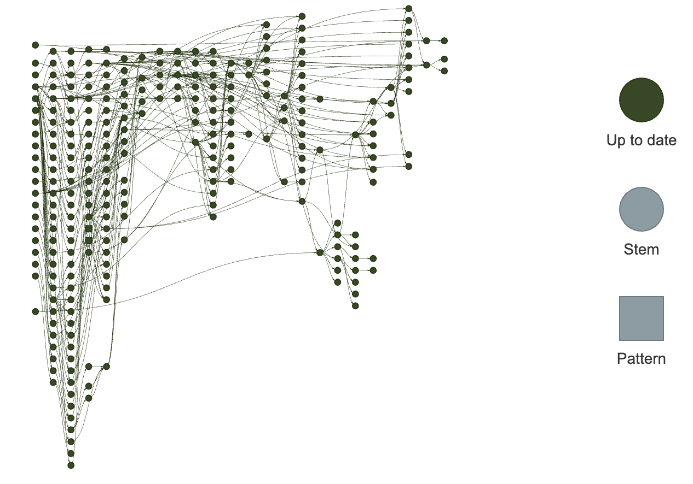

MA Stream Temperature and Thermal Habitat Model
===============================================

Prepared by: Jeffrey D Walker, PhD (<jeff@walkerenvres.com>, [Walker Environmental Research LLC](https://walkerenvres.com))  
For: [MA Division of Fisheries and Wildlife (MassWildlife)](https://www.mass.gov/orgs/division-of-fisheries-and-wildlife)

**Links**

- Interactive Data Explorer: https://walkerenvres.com/dev/masswildlife/
- Report and Output Datasets: [10.5281/zenodo.8145195](https://dx.doi.org/10.5281/zenodo.8145195)
- Model Source Code: [@walkerjeffd/masswildlife-mastath](https://github.com/walkerjeffd/masswildlife-mastath) (this repo)
- Website Source Code: [@walkerjeffd/masswildlife-mastath-explorer](https://github.com/walkerjeffd/masswildlife-mastath-explorer)

## Overview

This repo contains the source code for all data processing and model development in support of the MA Stream Temperature and Thermal Habitat (MASTATH) project. The project report is available at:

> Walker, J.D. (2023). A Regional Stream Temperature Model for Assessing Climate Change Impacts on Thermal Habitat in Massachusetts. Technical report prepared for Massachusetts Division of Fisheries and Wildlife (MassWildlife). July 13, 2023. DOI: [10.5281/zenodo.8145195](https://dx.doi.org/10.5281/zenodo.8145195)

## Dependencies

This project was developed using R v4.2.3. Required packages can be install using `{renv}`:

```r
renv::restore()
```

## Configuration

Credentials for accessing the EcoSHEDS stream temperature database must be specified in a `.env` file located in the project root directory. The file should contain the following:

```env
# .env file
ECOSHEDS_DB_HOST=
ECOSHEDS_DB_PORT=
ECOSHEDS_DB_DBNAME=
ECOSHEDS_DB_USER=
ECOSHEDS_DB_PASSWORD=
```

## Source Data

Source data are stored in the `data/` folder, which is not tracked by git due to the file sizes.

Some of the source datasets (Daymet, NHDPlusHR, and StreamStats) can be obtained using R scripts within the `scripts/` directory, which fetch the data using respective source APIs.

All other models inputs can be obtained upon request.

## R Code

The project data pipeline includes 1) loading, processing and cleaning raw data, 2) fitting models, 3) generating predictions, and 4) saving results to disk. The pipeline is implemented using the `{targets}` package. The pipeline is defined in `_targets.R` and can be run using:

```r
source("_targets.R")
tar_make()
```

Most targets are written to separate R scripts in the `R/` directory. These scripts are sourced by `_targets.R` and can be run independently. For example, to run only the observed data portion of the pipeline, use:

```r
tar_make(starts_with("obs"))
```

Note that the pipeline requires all input data files to be accessible within the `data/` folder.

Here is a snapshot of the pipeline network:

```r
tar_visnetwork(targets_only = TRUE)
```



## Output

All output files are saved to `data/output` as part of the targets pipeline.

## Notes

The `notes/` directory contains R scripts used during project development. These are likely to be out of date and may not run due to changes in file locations and data structures.

## License

[CC BY 4.0](https://creativecommons.org/licenses/by/4.0/) (see `LICENSE`)

